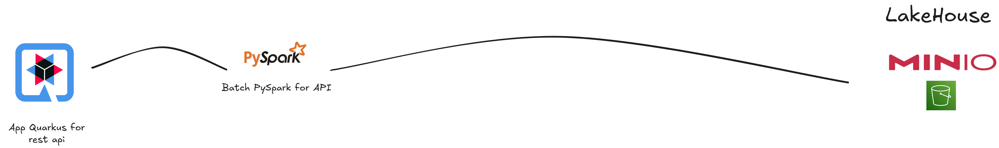

# Data Engineering 360º: Fundamentos para uma infraestrutura de dados moderna e resiliente

>:memo: **Nota:** Este caso apresentará uma abordagem completa para a conceção e implementação de uma infraestrutura de dados robusta e resiliente. O foco será a construção de pipelines escaláveis, governação eficiente e arquitecturas que suportem alta disponibilidade e tolerância a falhas. Além disso, serão exploradas as melhores práticas para a otimização do armazenamento, o processamento distribuído e a integração de diferentes fontes de dados, garantindo a fiabilidade e o desempenho para a análise e a tomada de decisões.

### Sumário

- [Objective](#objective)
- [Architecture Decision Record (ADR)](#architecture-decision-record-adr)
    - [ADR - 001](#adr---001)
    - [ADR - 002](#adr---002)
    - [ADR - 003](#adr---003)
    - [ADR - 004](#adr---004)
    - [ADR - 005](#adr---005)
- [System Design](#system-design)
    - [App Quarkus para rest API](#app-quarkus-para-rest-api)
    - [App PySpark para consumo do banco de dados](#app-pyspark-para-consumo-do-banco-de-dados)
    - [App PySpark para consumo do Kafka](#app-pyspark-para-consumo-do-kafka)
    - [App PySpark para consumo da API Quarkus](#app-pyspark-para-consumo-da-api-quarkus)
    - [App PySpark para consumo de arquivos CSVs](#app-pyspark-para-consumo-de-arquivos-csvs)
    - [App PySpark para consumo dos arquivos no Lakehouse](#app-pyspark-para-consumo-dos-arquivos-no-lakehouse)
- [Motivação](#motivação)
- [Melhorias](#melhorias)
- [Executando localmente o Case](#executando-localmente-o-case)
    - [Pré requisitos](#pré-requisitos)

## Objetivo
Esta documentação tem como objetivo apresentar uma arquitetura de dados end-to-end, mostrando como a stack de tecnologias foi planejada e implementada. O projeto detalha a movimentação dos dados desde sua chegada, passando pelo processamento nas camadas da architecture Medallion e aplicando o pattern Data Mesh. Serão destacados o uso de recursos nativos da cloud para escalabilidade, segurança e rastreabilidade, além de uma simulação local com Rancher Desktop, utilizando Kubernetes e Docker, para replicar o ambiente de forma prática.

## Architecture Decision Record (ADR)

### ADR - 001

**Título:** Escolha da Tecnologia PySpark.

| **Seção**               | **Descrição**                                                                                                                                                                           |
|-------------------------|-----------------------------------------------------------------------------------------------------------------------------------------------------------------------------------------|
| **Contexto**             | O projeto exige o processamento de grandes volumes de dados em um ambiente de nuvem (AWS), com foco em escalabilidade e integração com outros serviços da AWS, como S3 e Redshift.     |
| **Decisão**              | Utilizar PySpark no Amazon EMR para processamento distribuído de dados em larga escala.                                                                                                 |
| **Justificativa**        | - **Escalabilidade:** Amazon EMR permite escalar automaticamente os clusters conforme a demanda.   - **Integração com AWS:** Integração fácil com serviços como S3 e Redshift.   - **Suporte a Big Data:** PySpark é otimizado para grandes volumes de dados e operações complexas.   - **Gerenciamento Simplificado:** Solução totalmente gerenciada pelo EMR.   - **Custo-benefício:** Custos ajustáveis com clusters sob demanda. |
| **Alternativas Consideradas** | - **AWS Glue:** Para processamento sem servidor, mas com menos flexibilidade que PySpark.   - **Databricks:** Mais robusto, mas com custos mais altos em comparação ao EMR.         |
| **Consequências**        | - **Escalabilidade sob demanda:** Otimização de recursos e custos.   - **Complexidade de configuração:** Requer esforço inicial para configuração e otimização de clusters.   - **Especialização:** A equipe precisa de conhecimento em Spark e EMR.   - **Integração com AWS:** Fácil integração com o ecossistema AWS.                                  |
| **Referências**          | - [Documentação do Amazon EMR](https://aws.amazon.com/emr/)   - [Documentação do PySpark](https://spark.apache.org/docs/latest/api/python/)                                              |

 

### ADR - 002

**Título:** Escolha da Tecnologia para Microserviços

| **Seção**               | **Descrição**                                                                                                                                                                           |
|-------------------------|-----------------------------------------------------------------------------------------------------------------------------------------------------------------------------------------|
| **Contexto**             | O projeto exige a criação de microserviços escaláveis e eficientes em termos de desempenho. As tecnologias devem ser leves, de fácil integração e suportar um alto volume de requisições. |
| **Decisão**              | Utilizar **Quarkus** com **Java** para desenvolvimento de microserviços devido ao seu desempenho otimizado para ambientes de contêineres e ao seu foco em microserviços nativos para a nuvem. |
| **Justificativa**        | - **Desempenho e Tempo de Inicialização:** Quarkus foi projetado para otimizar tempo de inicialização e uso de memória, tornando-o ideal para ambientes em containers como Docker e Kubernetes.   - **Integração com GraalVM:** Quarkus pode ser compilado nativamente com GraalVM, reduzindo significativamente o tempo de execução e o uso de memória.   - **Desenvolvimento para Nuvem:** Focado em microserviços e ambientes nativos da nuvem, Quarkus possui integração fácil com ferramentas e plataformas como Kubernetes, OpenShift, etc.   - **Facilidade de Uso:** Sua configuração e uso são simplificados para desenvolvedores Java, com suporte à programação reativa e integração com bibliotecas Java tradicionais. |
| **Alternativas Consideradas** | - **Spring:** Amplamente utilizado e com uma vasta comunidade, oferece soluções robustas para microserviços, mas com tempo de inicialização mais lento e maior consumo de memória em comparação ao Quarkus.   - **Express (Node.js):** Solução rápida para microserviços em JavaScript/TypeScript, mas não tão otimizada em termos de desempenho e escalabilidade em comparação ao Quarkus, além de ser mais difícil de integrar em um ecossistema Java corporativo.  |
| **Consequências**        | - **Desempenho Melhorado:** Com o Quarkus, espera-se tempos de inicialização e uso de memória significativamente menores.   - **Facilidade de Configuração e Integração com Kubernetes:** Quarkus facilita a implementação de microserviços em ambientes baseados em contêineres.   - **Foco em Nuvem e Kubernetes:** A escolha de Quarkus alinha-se bem com arquiteturas nativas de nuvem, proporcionando escalabilidade eficiente.   - **Curva de Aprendizado:** A equipe precisará aprender as novas ferramentas e práticas associadas ao Quarkus, principalmente se já estiver acostumada com o Spring. |
| **Referências**          | - [Documentação do Quarkus](https://quarkus.io/)   - [Documentação do Spring](https://spring.io/projects/spring-boot)   - [Documentação do Express](https://expressjs.com/) |

 

### ADR - 003

**Título:** Escolha do Kubernetes

| **Seção**               | **Descrição**                                                                                                                                                                           |
|-------------------------|-----------------------------------------------------------------------------------------------------------------------------------------------------------------------------------------|
| **Contexto**             | O projeto exige uma solução robusta e escalável para orquestrar e gerenciar o deploy de aplicativos, incluindo microserviços, processamento distribuído de dados com **Spark**, e outros aplicativos. A necessidade de escalabilidade, flexibilidade e integração com a nuvem levou à escolha do **Kubernetes** |
| **Decisão**              | Optamos por utilizar **Kubernetes** como o sistema de gerenciamento de clusters para o deploy de qualquer aplicativo, incluindo **microserviços com Quarkus** e processamento com **Spark**. Kubernetes fornecerá mais flexibilidade, escalabilidade e integração com outros serviços, além de ser amplamente adotado. |
| **Justificativa**        | - **Escalabilidade e Flexibilidade:** Kubernetes oferece escalabilidade granular e flexível para todos os tipos de workloads, incluindo microserviços e clusters Spark, com fácil gerenciamento de contêineres.   - **Suporte a Multicloud:** Kubernetes é agnóstico de nuvem, permitindo sua execução em múltiplos provedores, como AWS, GCP, e Azure. Ao contrário do YARN, que é mais restrito à AWS, Kubernetes proporciona mais liberdade.   - **Facilidade de Integração com Outras Ferramentas:** Kubernetes integra-se facilmente com ferramentas de CI/CD, monitoramento, logging, além de facilitar o deploy de microserviços e aplicações distribuídas, oferecendo integração com Helm para automação de deploys.   - **Menor Sobrecarga de Gestão:** Apesar da curva de aprendizado inicial, Kubernetes oferece uma administração mais padronizada e menos dependente de infraestrutura específica da nuvem. |
| **Alternativas Consideradas** | - **Amazon ECS (Elastic Container Service):** Solução útil para orquestração de containers dentro da AWS, mas ainda assim não oferece a mesma flexibilidade, portabilidade e funcionalidades nativas que o Kubernetes proporciona para qualquer tipo de aplicação. |
| **Consequências**        | - **Escalabilidade e Flexibilidade:** Kubernetes permitirá a escalabilidade eficiente de qualquer tipo de aplicação, incluindo Spark e Quarkus, com uma gestão simples de recursos.   - **Portabilidade e Agnosticismo:** A escolha de Kubernetes facilita a migração entre diferentes provedores de nuvem, tornando o sistema mais flexível e menos dependente de uma infraestrutura específica da AWS.   - **Maior Complexidade Inicial:** Kubernetes exige um maior envolvimento inicial para configurar e gerenciar clusters, mas os benefícios a longo prazo superam esse custo.   |
| **Referências**          | - [Documentação do Kubernetes](https://kubernetes.io/docs/)   - [Documentação do Spark no Kubernetes](https://spark.apache.org/docs/latest/running-on-kubernetes.html)   - [Documentação do YARN (EMR)](https://docs.aws.amazon.com/emr/latest/ReleaseGuide/emr-spark-yarn.html) |

 

### ADR - 004

**Título:** Escolha do Debezium para CDC (Change Data Capture)

| **Seção**               | **Descrição**                                                                                                                                                                           |
|-------------------------|-----------------------------------------------------------------------------------------------------------------------------------------------------------------------------------------|
| **Contexto**             | O projeto requer uma solução eficiente para capturar mudanças de dados em tempo real (Change Data Capture - CDC) em bancos de dados relacionais e propagá-las para outros sistemas, como data lakes, filas de mensagens ou sistemas de analytics. A necessidade é garantir que as alterações nos dados sejam detectadas e processadas de forma confiável e com baixa latência, mantendo a simplicidade na integração com pipelines existentes. |
| **Decisão**              | Decidimos adotar o **Debezium** como a solução principal para implementar o CDC. O Debezium é uma plataforma open-source que utiliza conectores baseados em Kafka Connect para capturar alterações em bancos de dados e transmiti-las como eventos em tempo real. |
| **Justificativa**        | - **Captura de Mudanças em Tempo Real:** O Debezium monitora logs de transações (como binlogs ou WAL) de bancos de dados, capturando inserções, atualizações e exclusões em tempo real com alta fidelidade.   - **Integração com Kafka:** Ele se integra nativamente ao Apache Kafka via Kafka Connect, permitindo que os eventos capturados sejam facilmente consumidos por outros sistemas downstream em um pipeline de dados escalável.   - **Suporte a Diversos Bancos de Dados:** O Debezium oferece conectores para bancos populares como MySQL, PostgreSQL, SQL Server, Oracle e MongoDB, o que o torna versátil para diferentes ambientes.   - **Simplicidade Operacional:** Por ser baseado em Kafka Connect, o Debezium é relativamente fácil de configurar e gerenciar, especialmente em ambientes que já utilizam Kafka.   - **Consistência e Confiabilidade:** O Debezium garante que todas as mudanças sejam capturadas na ordem exata em que ocorrem, oferecendo consistência de dados e suporte a snapshots iniciais para sincronização. |
| **Alternativas Consideradas** | - **Custom Scripts com Triggers:** Criar scripts personalizados ou usar triggers de banco de dados para capturar mudanças foi considerado, mas essa abordagem é frágil, difícil de escalar e não oferece a robustez e confiabilidade de uma solução dedicada como o Debezium.   - **Oracle GoldenGate:** Uma alternativa comercial, o GoldenGate é poderoso, mas caro e menos flexível em ecossistemas open-source, além de ter uma curva de aprendizado mais íngreme em comparação com o Debezium. |
| **Consequências**        | - **Captura Eficiente de Dados:** O Debezium permitirá capturar mudanças em tempo real com baixa latência, garantindo que os sistemas downstream estejam sempre atualizados.   - **Dependência do Kafka:** A adoção do Debezium implica a necessidade de um cluster Kafka (ou pelo menos Kafka Connect), o que pode aumentar a complexidade em ambientes que ainda não utilizam essa tecnologia.   - **Escalabilidade:** Com o Kafka como backbone, o sistema será escalável para lidar com grandes volumes de eventos de CDC, mas exige monitoramento adequado do cluster.   - **Manutenção Simplificada:** A configuração baseada em conectores reduz a necessidade de desenvolvimento personalizado, mas exige familiaridade com o ecossistema Kafka e ajustes finos para desempenho otimizado.   - **Flexibilidade Limitada no Processamento:** O Debezium foca na captura e entrega de eventos, mas não oferece capacidades avançadas de transformação de dados, que precisariam ser implementadas em etapas posteriores do pipeline (ex.: com Flink ou Spark). |
| **Referências**          | - [Documentação Oficial do Debezium](https://debezium.io/documentation/)   - [Kafka Connect Documentation](https://kafka.apache.org/documentation/#connect)   - [Apache Flink Documentation](https://flink.apache.org/documentation.html) |

 

### ADR - 005

**Título:** Escolha da AWS
| **Seção**               | **Descrição**                                                                                                                                                                           |
|-------------------------|-----------------------------------------------------------------------------------------------------------------------------------------------------------------------------------------|
| **Contexto**             | O projeto exige uma plataforma de nuvem para suportar uma arquitetura de dados escalável, segura e integrada, com processamento de grandes volumes de dados, armazenamento eficiente e suporte a simulações locais e em produção. A escolha da nuvem impacta diretamente a infraestrutura, os custos e a facilidade de integração com ferramentas modernas. |
| **Decisão**              | Optamos por utilizar a **Amazon Web Services (AWS)** como provedor de nuvem principal para hospedagem, processamento e gerenciamento da arquitetura de dados. |
| **Justificativa**        | - **Escalabilidade:** A AWS oferece serviços como EC2, ECS e EMR que escalam automaticamente conforme a demanda.   - **Ecossistema Rico:** Integração nativa com S3 (armazenamento), RDS (bancos relacionais), Redshift (data warehouse) e Lambda (serverless).   - **Segurança:** Recursos robustos como IAM, KMS e VPC garantem proteção de dados e conformidade.   - **Ferramentas Gerenciadas:** Serviços como AWS Glue e Macie simplificam ETL e auditoria de dados.   - **Custo Flexível:** Modelo pay-as-you-go e opções como Spot Instances otimizam custos. |
| **Alternativas Consideradas** | GCP, AZURE E ORACLE CLOUD |
| **Consequências**        | - **Escalabilidade e Disponibilidade:** Infraestrutura robusta para picos de uso e alta disponibilidade global.   - **Curva de Aprendizado:** Exige familiaridade com serviços AWS para configuração otimizada.   - **Custo Controlável:** Modelo flexível, mas exige monitoramento para evitar gastos excessivos.   - **Integração Local:** Suporte a simulações com Rancher Desktop via SDKs e ferramentas como LocalStack. |
| **Referências**          | - [Documentação Oficial da AWS](https://docs.aws.amazon.com/)   - [AWS Architecture Center](https://aws.amazon.com/architecture/) |

## System Design
A seguir, veremos o desenho da arquitetura pensado para este case. Nos próximos tópicos, falaremos mais especificamente sobre o que cada aplicativo será responsável por fazer.

---

#### App Quarkus para rest API
Este aplicativo tem como objetivo consumir os dados da API do governo e armazenar essas informações no banco de dados. Além de disponibilizar o acesso a esses dados por meio de chamadas REST, neste fluxo também teremos o passo para CDC, onde o Debezium monitorará ações na tabela e, a cada nova atualização, será disparada uma mensagem em um tópico Kafka.

---

#### App PySpark para consumo do banco de dados
Este aplicativo tem como objetivo consumir os dados diretamente do banco de dados, onde abordaremos as melhores práticas para esse tipo de consumo sem sobrecarregar o banco. Ao final do processo, escreveremos um arquivo em um bucket, seguindo os padrões de Data Mesh e da Arquitetura Medallion

---

#### App PySpark para consumo do Kafka
Este aplicativo streaming tem como objetivo processar os dados que vem do topico Kafka em tempo real e ao final do seu processo, escrever um arquivo em um bucket, seguindo os padrões de Data Mesh e da Arquitetura Medallion

---

#### App PySpark para consumo da API Quarkus
Este aplicativo tem como objetivo consumir os dados por meio da API REST da aplicação Quarkus, mencionada anteriormente, e, ao final do seu processo, escrever um arquivo em um bucket, seguindo os padrões de Data Mesh e da Arquitetura Medallion

---

#### App PySpark para consumo de arquivos CSVs
Este aplicativo tem como objetivo consumir os dados armazenados no bucket em formato CSV, realizar o enriquecimento desses dados e salvá-los na camada Silver do nosso bucket, seguindo os padrões de Data Mesh e da Arquitetura Medallion

---

#### App PySpark para consumo dos arquivos no Lakehouse
Este aplicativo tem como objetivo consumir os dados armazenados no Lakehouse, realizar o enriquecimento desses dados e salvá-los na camada Silver do nosso bucket, seguindo os padrões de Data Mesh e da Arquitetura Medallion

## Motivação

Este caso foi cuidadosamente planejado para abranger todas as formas possíveis de extração e ingestão de dados, assegurando que o processo seja executado de ponta a ponta com alta performance, escalabilidade robusta e segurança reforçada. Nosso objetivo é garantir uma solução completa que contemple desde a coleta inicial dos dados até sua integração em um fluxo contínuo e confiável, atendendo às demandas de um ambiente dinâmico e complexo. As duas principais fontes de dados consideradas neste projeto provêm de órgãos públicos de saúde brasileiros, que disponibilizam diferentes métodos de consumo, como APIs RESTful e arquivos CSV, oferecendo flexibilidade para a captura das informações. A partir dessas fontes, nosso pipeline de processamento entra em ação, estruturado para lidar com os dados de maneira eficiente e organizada.

Para coordenar esse fluxo, idealizei a criação de algumas DAGs (Directed Acyclic Graphs) no Apache Airflow, uma ferramenta amplamente reconhecida por sua capacidade de orquestrar tarefas de forma programática e visual. Essas DAGs foram pensadas para iniciar o trabalho de maneira estruturada, definindo claramente cada etapa do processo e garantindo uma execução coordenada e monitorável. Além disso, para elevar o nível de segurança e conformidade, implementei guardrails específicos, como o mascaramento de dados sensíveis, protegendo informações críticas durante o processamento.

## Melhorias
Como oportunidade de melhoria, vejo a possibilidade de enriquecer nossa arquitetura integrando diversos serviços da AWS que podem potencializar tanto a auditoria quanto a gestão inteligente dos dados, trazendo maior visibilidade e eficiência ao processo. Especificamente, podemos incorporar ferramentas como o AWS Glue e o AWS Athena, que se complementam e agregam valor significativo ao nosso fluxo de trabalho, esses serviços podem atuar como aliados estratégicos na auditoria, ajudando a identificar padrões, inconsistências ou até mesmo anomalias nos dados, o que reforça a governança e a conformidade em um ambiente orientado dados.

## Executando localmente o Case

#### Pré-requisitos
 

* <strong>Java</strong>.
[How to install Java?](https://www.oracle.com/java/technologies/downloads/)
 

* <strong>Python</strong>.
[How to install Python?](https://realpython.com/installing-python/) 
 

* <strong>PySpark</strong>.
[How to install PySpark?](https://spark.apache.org/docs/latest/api/python/getting_started/install.html) 
 
* <strong>Rancher Desktop</strong>.
[How to install Rancher Desktop?](https://docs.rancherdesktop.io/getting-started/installation/) 
 
* <strong>Terraform</strong>.
[How to install Terraform?](https://developer.hashicorp.com/terraform/tutorials/aws-get-started/install-cli) 
 
* <strong>Helm</strong>.
[How to install Helm?](https://helm.sh/docs/intro/install/) 
 
* <strong>AWS CLI</strong>.
[How to install AWS CLI?](https://docs.aws.amazon.com/cli/latest/userguide/getting-started-install.html) 
 
* <strong>Git</strong>.
[How to install Git?](https://git-scm.com/book/en/v2/Getting-Started-Installing-Git) 
 
